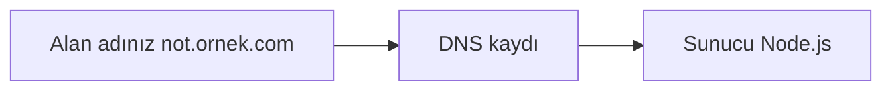

# Not Belirleme PWA

Bulmacayı çözerek sınav notunu öğrenen Progressive Web App. **Firebase gerekmez** — veriler yerel Node.js sunucusunda tek bir JSON dosyasında tutulur; tüm cihazlar aynı ağdaki veya yayınlanmış sunucuya bağlanır.

## Özellikler

- **Kullanıcı alanı** (`/`): Matematik veya çoktan seçmeli bulmaca, 3 deneme hakkı, doğru cevapta "Tebrikler!" pop-up'ı
- **Admin paneli** (`/admin.html`): Şifre ile giriş, not kaydetme (0–100), şifre değiştirme
- **Canlı senkron**: Admin not kaydedince öğrenci ekranları anında güncellenir (SSE)
- **PWA**: Ana ekrana eklenebilir

## Gereksinimler

- [Node.js](https://nodejs.org/) 18 veya üzeri

## Kurulum ve çalıştırma

```bash
cd "Not belirleme uygulaması"
npm install
npm start
```

Tarayıcıda:

- Kullanıcı: **http://localhost:3000**
- Admin: **http://localhost:3000/admin.html**
- Varsayılan şifre: **admin123** (ilk çalıştırmada otomatik oluşturulur)

## Aynı Wi‑Fi’de telefon/tablet

1. Bilgisayar ve telefon **aynı Wi‑Fi** ağında olsun.
2. `npm start` çalıştırın — terminalde **192.168.x.x:3000** adresi yazılır.
3. Telefonda tarayıcıya bu adresi yazın (`localhost` telefonda **çalışmaz**).
4. Açılmazsa Windows güvenlik duvarını açın (bir kez, yönetici olarak):
   ```powershell
   # PowerShell'i Yönetici olarak açın, proje klasöründe:
   npm run firewall
   ```
   veya `scripts\open-firewall.ps1` dosyasına sağ tık → Yönetici olarak çalıştır.

Admin ve kullanıcı sayfalarında mavi kutuda telefon adresi de görünür.

## Alan adı (domain) bağlama

Alan adı yalnızca **internette çalışan bir sunucuya** yönlendirilir. Bilgisayarınızda `npm start` sadece ev/iş ağı içindir; domain için uygulamayı buluta veya tünel ile dışarı açmanız gerekir.

### Genel akış



1. Bir **alan adı** satın alın (GoDaddy, Natro, Cloudflare Registrar, Google Domains vb.).
2. Uygulamayı **7/24 açık** bir sunucuda çalıştırın (aşağıdaki yöntemlerden biri).
3. Alan adı panelinde **DNS** kaydı ekleyin (barındırma firmasının verdiği adres/CNAME).
4. **HTTPS** açın (PWA ve güvenlik için zorunlu); çoğu barındırıcı otomatik verir.

---

### Yöntem A — Render (kolay, ücretsiz başlangıç)

1. Projeyi [GitHub](https://github.com)’a yükleyin.
2. [render.com](https://render.com) → **New → Web Service** → repoyu seçin.
3. Ayarlar:
   - **Build Command:** `npm install`
   - **Start Command:** `npm start`
   - **Instance type:** Free (uyku modu olabilir; ücretli planda sürekli açık)
4. Deploy bitince size `https://not-bulmaca-xxxx.onrender.com` gibi bir adres verilir.
5. Render → **Settings → Custom Domains** → `not.sizinokul.com` ekleyin.
6. Alan adı sağlayıcınızda DNS:
   - **CNAME** `not` → Render’ın gösterdiği hedef (ör. `not-bulmaca-xxxx.onrender.com`)
   - veya kök domain (`sizinokul.com`) için Render’ın verdiği **A kayıtları**
7. Birkaç dakika–48 saat sonra `https://not.sizinokul.com` açılır.

**Önemli:** Ücretsiz planda `data/store.json` sunucu yeniden başlayınca silinebilir. Kalıcı veri için Render **Disk** ekleyin veya ücretli plan kullanın.

---

### Yöntem B — Railway / Fly.io

Railway ve Fly.io da benzer: repoyu bağla → `npm start` → panelden **Custom Domain** → DNS’te CNAME.

---

### Yöntem C — Cloudflare Tunnel (önerilen: kendi PC + kendi domain)

Modemde port açmadan `npm start` → `https://not.sizindomain.com`

**Tam rehber:** [`docs/CLOUDFLARE-TUNNEL.md`](docs/CLOUDFLARE-TUNNEL.md)

Kısa özet:

```powershell
winget install Cloudflare.cloudflared
cloudflared tunnel login
cloudflared tunnel create not-bulmaca
Copy-Item cloudflare\config.yml.example cloudflare\config.yml
# config.yml içinde Tunnel ID, credentials yolu ve hostname düzenleyin
cloudflared tunnel route dns not-bulmaca not.sizindomain.com
npm run start:public
```

- **HTTPS** otomatik (Cloudflare)
- Telefon mobil veriden de açılır
- PC kapalıyken site kapalıdır

---

### Yöntem D — VPS (DigitalOcean, Hetzner, Turhost VPS)

1. Sunucuda Node 18+, projeyi klonlayın, `npm install`, `pm2 start server.js`.
2. **Nginx** reverse proxy: 80/443 → `localhost:3000`
3. **Let’s Encrypt:** `certbot --nginx -d not.sizinokul.com`
4. DNS: **A kaydı** `not` → sunucunun sabit IP’si

---

### DNS örnekleri

| Ne istiyorsunuz? | Kayıt türü | Ad | Değer |
|------------------|------------|-----|--------|
| `not.okul.com` | CNAME | `not` | Barındırıcının verdiği adres |
| `okul.com` (kök) | A | `@` | Barındırıcının IP listesi |

Panelde **Proxy/CDN** (turuncu bulut) açıksa Cloudflare kullanıyorsunuzdur; Render/Railway CNAME yine aynı mantıkla eklenir.

---

### Yayın sonrası

- Kullanıcılar: `https://not.sizinokul.com`
- Admin: `https://not.sizinokul.com/admin.html`
- İlk girişte admin şifresini mutlaka değiştirin.
- `manifest.json` içindeki `start_url` alan adınızle uyumlu kalır (göreli yol `./index.html`).

Hangi yöntemi seçeceğinizi söylerseniz (Render / Cloudflare Tunnel / VPS) o seçeneğe özel adım adım kurulum da yazılabilir.

## Veri dosyası

Tüm veriler [`data/store.json`](data/store.json) içinde saklanır (şifre hash’i + bulmaca). Bu dosya `.gitignore` içindedir.

## API özeti

| Endpoint | Açıklama |
|----------|----------|
| `GET /api/puzzle` | Aktif bulmaca (herkese açık) |
| `GET /api/puzzle/stream` | Canlı güncelleme (SSE) |
| `POST /api/admin/login` | Admin girişi → token |
| `PUT /api/admin/grade` | Not + bulmaca kaydet (token gerekli) |
| `PUT /api/admin/password` | Şifre değiştir (token gerekli) |

Ham not yalnızca sunucudaki `admin.grade` alanında tutulur; istemciye yalnızca bulmaca ve hash gönderilir.

## Eski Firebase dosyaları

`js/firebase-init.js`, `firestore.rules` ve `firebase.json` artık kullanılmıyor; silinebilir veya arşivlenebilir.

## Test kontrol listesi

- [ ] `npm start` sonrası admin girişi ve not kaydı
- [ ] Farklı tarayıcıda bulmacanın görünmesi
- [ ] Doğru cevap → Tebrikler + not
- [ ] 3 yanlış → Yanlış + kilit → Tekrar dene
- [ ] Not değişince bulmacanın güncellenmesi
